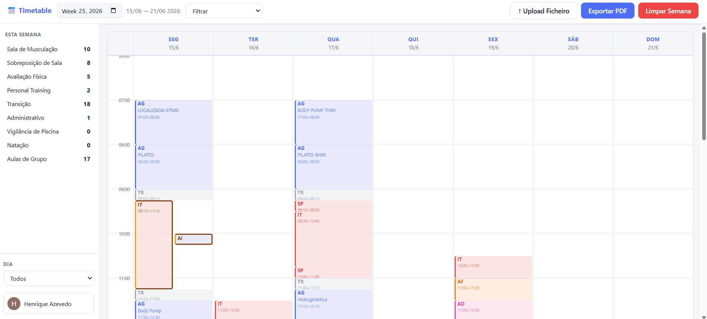

# Work Timetable Manager

> Turn a confusing weekly Excel timetable into a clean, personalised Google Calendar in seconds.

[](https://spring.io/projects/spring-boot)
[](https://react.dev)
[](https://railway.app)
[](https://vercel.com)
[](https://developers.google.com/identity)
[](LICENSE)

---

## Table of Contents

- [About](#about)
- [Screenshots](#screenshots)
- [Features](#features)
- [Tech Stack](#tech-stack)
- [How It Works](#how-it-works)
- [Getting Started](#getting-started)
- [Environment Variables](#environment-variables)
- [Project Structure](#project-structure)
- [Roadmap](#roadmap)
- [License](#license)

---

## About

Every week in my company, gym instructors across all 120 locations receive a large, densely packed Excel timetable shared with their entire local team. That timetable covers the schedules of the whole team — the average team has around 10 workers — so each instructor has to find their own daily sessions among 9 other people's initials across up to 15 different task columns. Finding your own sessions is therefore error-prone and time-consuming, and missing or misreading one has real consequences: it can impact gym quality and erode trust in workers when errors happen repeatedly.

**Work Timetable Manager** was built to solve this. Upload the weekly Excel file and the app automatically extracts your sessions, shows you a clean weekly calendar preview, and exports each session directly to your Google Calendar, complete with the correct title, time, colour, and any notes you want to add. Personal trainer sessions can also be customised to fit each trainer/student's individual needs.

The app uses Google Sign-In exclusively, so there is no need to create a separate account. It connects automatically to your personal Google Calendar.

The result: **no more manually reading a 316-column spreadsheet**. Your week is ready in your calendar with no pain or errors.

This has already been rolled out to my team at one gym, but if adopted company-wide it could significantly reduce scheduling errors and stress. If Coordinating Managers (CMs) are interested, the app can be extended with an admin dashboard that lets them distribute timetables directly to their teams, eliminating the Excel file entirely.

---

## Screenshots

### Sign In
> Log in with your Google account — no separate registration required.


---

### Upload Your Timetable
> Drag and drop the weekly `.xlsx` file, pick the week, and enter your initials. The app does the rest.


> **Want to try it out?** A sample timetable file matching the expected format is included at [`docs/timetable_example.xlsx`](docs/timetable_example.xlsx). Download it and upload it in the app to see the full parsing and export flow without needing a real company timetable.

---

### Review Before Exporting
> Inspect every parsed session, deselect anything you don't want, and confirm before anything is written to your calendar. Personalise PT blocks to fit individual trainer/student needs and add notes to any session — for example, which release you plan to teach in a class or which client you will be evaluating in an AF.


---

### Your Weekly Dashboard
> Browse any week at a glance. Filter by session type or day, edit session notes, and export a PDF for offline reference or when you can't access Google Calendar on your phone.



---

### Personalise Sessions & Notes
> Click any session to rename the class, add notes, or delete it — both from the database and Google Calendar simultaneously.


---

## Features

| Feature | Description |
|---|---|
| **Google Sign-In** | One-click login via Google OAuth 2.0; no passwords stored; no in-app users needed |
| **Excel parsing** | Reads the gym's proprietary 316-column `.xlsx` layout; handles merged cells, carry-forward abbreviations, and sub-location labels |
| **Smart session detection** | Automatically groups consecutive 15-minute slots into sessions, detects overlaps, and splits weight-room blocks around group-class conflicts |
| **Calendar preview** | Full review step before export — deselect sessions, see overlap warnings, split/group PT client workouts |
| **Google Calendar export** | Creates colour-coded events with correct titles, times, and notes directly in your primary Google Calendar |
| **Weekly dashboard** | Visual calendar grid filtered by type or day; metrics sidebar with per-type session counts |
| **In-app editing** | Edit class name and notes on any session; changes sync to Google Calendar instantly |
| **PDF export** | Generate a printable weekly schedule with one click |
| **Clear week** | Remove all sessions for a week from both the database and Google Calendar in one action |
| **Overlap detection** | Flagged sessions are highlighted at preview time so you can resolve conflicts before exporting |

---

## Tech Stack

### Backend
| Technology | Version | Role |
|---|---|---|
| Java | 17 | Language |
| Spring Boot | 3.2.5 | Application framework |
| Spring Security | 6.x | Stateless token-based auth |
| Spring Data JPA | 3.2.5 | Database ORM |
| Hibernate | 6.x | JPA implementation |
| PostgreSQL | — | Persistent storage |
| Apache POI | 5.x | Excel (`.xlsx`) parsing |
| Google Calendar API | v3 | Calendar event management |
| Google Auth Library | 1.x | OAuth token handling |
| Maven | 3.x | Build tool |
| Docker | — | Container for Railway deploy |

### Frontend
| Technology | Version | Role |
|---|---|---|
| React | 19 | UI framework |
| Vite | 6.x | Build tool & dev server |
| React Router | 7.x | Client-side routing (HashRouter) |
| Axios | 1.x | HTTP client with auth interceptors |
| jsPDF | 2.x | In-browser PDF generation |

### Infrastructure
| Service | Purpose |
|---|---|
| [Railway](https://railway.app) | Backend hosting + PostgreSQL database (on Neon) |
| [Vercel](https://vercel.com) | Frontend hosting |
| Google Cloud Console | OAuth 2.0 credentials & Calendar API |

---

## How It Works

```
┌─────────────────────────────────────────────────────────────────┐
│                        USER FLOW                                │
├─────────────────────────────────────────────────────────────────┤
│  1. Sign in with Google                                         │
│     └─ OAuth 2.0 implicit flow → access token stored in memory │
│                                                                 │
│  2. Upload the weekly .xlsx file                                │
│     └─ POST /api/timetable/upload (multipart)                   │
│        └─ Backend parses 316-column Excel layout:               │
│           • Discovers day blocks from Row 1 headers             │
│           • Maps abbreviations (IT, PT, AG…) to session types   │
│           • Groups consecutive 15-min slots per instructor      │
│           • Splits IT sessions around AI (group class) slots    │
│           • Detects time overlaps                               │
│                                                                 │
│  3. Review parsed sessions                                      │
│     └─ Frontend shows calendar preview with overlap warnings    │
│        └─ Deselect unwanted sessions, split PT client groups    │
│                                                                 │
│  4. Export to Google Calendar                                   │
│     └─ POST /api/timetable/export                               │
│        └─ Backend creates colour-coded Calendar events          │
│        └─ Sessions persisted to PostgreSQL with event IDs       │
│                                                                 │
│  5. Manage in the Dashboard                                     │
│     └─ Edit, delete, filter, export PDF                        │
└─────────────────────────────────────────────────────────────────┘
```

### Authentication Model

The app uses **Google's token introspection endpoint** (`googleapis.com/oauth2/v1/tokeninfo`) on every request. No JWTs are issued by the backend — the Google access token is the credential. This keeps auth simple and delegates expiry/revocation entirely to Google.

### Excel Parsing

The gym timetable is a proprietary `.xlsx` file with up to **316 columns** (one day block per 44 columns). The parser:

1. Reads Row 1 to dynamically discover day-column boundaries from Portuguese day headers (`"2ª FEIRA"`, `"SÁBADO"`, etc.)
2. Falls back to hardcoded column ranges if Row 1 headers are missing or unrecognised
3. Scans Rows 2–4 for session-type abbreviations (with carry-forward for merged cells)
4. Reads Row 4 sub-labels within AG (group class) columns to identify specific studios
5. Iterates data rows (5–70) collecting consecutive cells containing the instructor's initials

---

## Getting Started

### Prerequisites

- Java 17+
- Node.js 18+
- Maven 3.8+
- PostgreSQL 14+ (or a Railway PostgreSQL instance)
- A Google Cloud project with:
  - **OAuth 2.0 Web Client** credentials
  - **Google Calendar API** enabled

### Try the Example Timetable

A sample `.xlsx` file matching the expected format is included at [`docs/timetable_example.xlsx`](docs/timetable_example.xlsx). Once the app is running, upload it on the Upload page to see the full parsing and export flow without needing a real company timetable.

### Running Locally

**1. Clone the repository**

```bash
git clone https://github.com/henrique-s-azevedo/work-timetable-manager.git
cd work-timetable-manager
```

**2. Configure the backend**

Create a `.env` file or set the environment variables listed in the [Environment Variables](#environment-variables) section, then:

```bash
cd backend
mvn spring-boot:run
# Starts on http://localhost:8080
```

**3. Configure the frontend**

```bash
cd frontend
npm install
```

Create a `.env.local` file:

```env
VITE_API_BASE_URL=http://localhost:8080
VITE_GOOGLE_CLIENT_ID=your-google-client-id
```

```bash
npm run dev
# Starts on http://localhost:5173
```

### Running with Docker (backend only)

```bash
cd backend
docker build -t work-timetable-manager-backend .
docker run -p 8080:8080 \
  -e DATABASE_URL=jdbc:postgresql://... \
  -e DATABASE_USERNAME=... \
  -e DATABASE_PASSWORD=... \
  -e GOOGLE_CLIENT_ID=... \
  -e GOOGLE_CLIENT_SECRET=... \
  -e CORS_ALLOWED_ORIGINS=http://localhost:5173 \
  work-timetable-manager-backend
```

---

## Environment Variables

### Backend

| Variable | Required | Description |
|---|---|---|
| `DATABASE_URL` | Yes | PostgreSQL JDBC URL (`jdbc:postgresql://host:port/db`) |
| `DATABASE_USERNAME` | Yes | PostgreSQL username |
| `DATABASE_PASSWORD` | Yes | PostgreSQL password |
| `GOOGLE_CLIENT_ID` | Yes | OAuth 2.0 client ID from Google Cloud Console |
| `GOOGLE_CLIENT_SECRET` | Yes | OAuth 2.0 client secret |
| `CORS_ALLOWED_ORIGINS` | Yes | Comma-separated list of allowed frontend origins |

### Frontend

| Variable | Required | Description |
|---|---|---|
| `VITE_API_BASE_URL` | Yes | Backend base URL (e.g. `https://your-backend.railway.app`) |
| `VITE_GOOGLE_CLIENT_ID` | Yes | Same OAuth 2.0 client ID as the backend |

---

## Project Structure

```
work-timetable-manager/
├── backend/
│   ├── src/
│   │   ├── main/java/com/gymtimetable/
│   │   │   ├── config/          # Security filter, CORS, Spring Security config
│   │   │   ├── controller/      # REST endpoints (auth, timetable)
│   │   │   ├── dto/             # ParsedSessionDTO
│   │   │   ├── model/           # Instructor, TimetableSession JPA entities
│   │   │   ├── repository/      # Spring Data JPA repositories
│   │   │   └── service/         # TimetableParserService, GoogleCalendarService
│   │   └── resources/
│   │       └── application.properties
│   ├── Dockerfile
│   └── pom.xml
│
├── frontend/
│   ├── src/
│   │   ├── components/          # WeeklyCalendar, SessionsPreview, EditSessionModal, …
│   │   ├── context/             # AuthContext (Google token + user state)
│   │   ├── pages/               # Login, Dashboard, Profile
│   │   ├── utils/               # pdfExport.js
│   │   ├── api.js               # Axios instance with auth interceptor
│   │   └── App.jsx              # Router setup + ProtectedRoute
│   ├── index.html
│   └── vite.config.js
│
└── docs/
    ├── timetable_example.xlsx   # Sample timetable for testing
    └── images/                  # Screenshots used in this README
```

---

## Roadmap

The following features are planned for future releases:

- **Custom session colours** — let each instructor choose their own colour scheme for session types instead of using the default Google Calendar palette
- **Custom personal sessions** — add non-timetable activities (gym sessions, meetings, personal appointments) directly in the app, removing the need for a separate calendar app to manage the full week
- **Apple Calendar support** — extend the export functionality to Apple Calendar for users outside the Google ecosystem
- **Admin dashboard** *(requires management buy-in)* — a manager-facing view that links all team members to their supervisor, enabling timetables to be built and distributed directly within the app — eliminating the Excel file entirely and reducing the organisational overhead that comes with it

---

<div align="center">
  Built to save time, reduce errors, and make Mondays a little less chaotic.<br/>
  <sub>Made with Spring Boot + React · Deployed on Railway & Vercel</sub>
</div>
